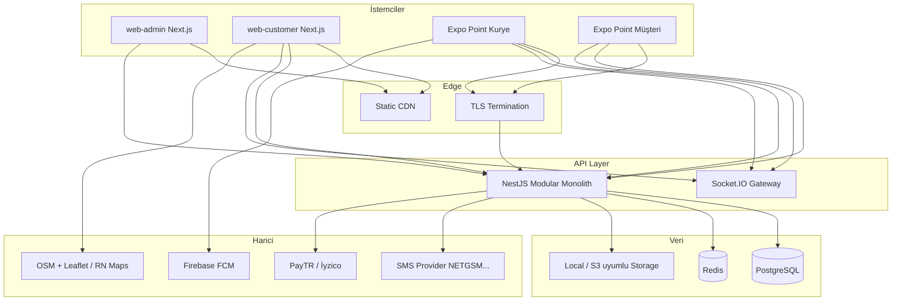
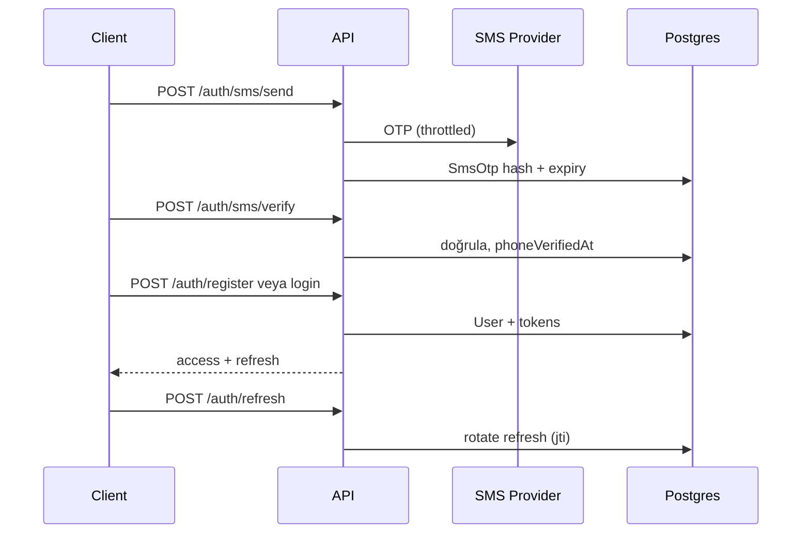

# Point — Mimari (`docs/ARCHITECTURE.md`)

Bu belge, **Point** (moto/arabalı kurye ve anlık teslimat marketplace) için üretim odaklı mimariyi tek kaynakta toplar. Kod kökü: monorepo (`apps/*`, `packages/*`). Marka rengi: `#16B24B`.

---

## 1. Full system architecture

**Modüler monolit (NestJS)** tek API yüzeyi; **PostgreSQL** otorite; **Redis** rate limit, OTP throttling, Socket.IO adapter opsiyonu; **Socket.IO** düşük frekanslı canlılık; **Next.js 15** iki web uygulaması; **Expo Router** ile iki ayrı mobil uygulama (`mobile-courier`, `mobile-customer`); **Prisma** şema ve migration; **provider pattern** ile storage, SMS, ödeme.



**Temel iş akışı:** müşteri teslimat oluşturur → durum `PENDING` → ödeme / doğrulama kuralları → `POOL` → uygun kuryeler görür → atomik `accept` → atama → yol ve paket alındı → teslim → komisyon muhasebesi ve kurye cüzdanına hakediş.

---

## 2. Folder structure (önerilen enterprise düzen)

```
point/
├── apps/
│   ├── api/                      # NestJS modular monolith
│   │   └── src/
│   │       ├── main.ts
│   │       ├── app.module.ts
│   │       ├── common/           # guards, pipes, interceptors, decorators
│   │       ├── config/
│   │       ├── modules/          # feature modules (aşağıda)
│   │       └── providers/        # storage, sms, payment adapters
│   ├── web-admin/
│   │   └── src/app/              # App Router, dashboard sayfaları
│   ├── web-customer/
│   │   └── src/app/
│   ├── mobile-courier/           # Expo Router — kurye (havuz, aktif işler)
│   │   └── app/
│   └── mobile-customer/          # Expo Router — müşteri (siparişler, hesap)
│       └── app/
├── packages/
│   ├── database/                 # Prisma schema + migrations
│   └── ui/                       # (opsiyonel) paylaşılan headless bileşenler
├── docs/
│   ├── ARCHITECTURE.md
│   ├── API.md
│   └── ROADMAP.md
├── docker-compose.yml
├── package.json                  # npm workspaces
└── .cursor/rules/point.mdc
```

---

## 3. Database architecture

- **Kimlik:** `User` tekil; `phone` unique; `tcKimlikNo` unique (global tek kullanım); müşteri ve kurye profilleri ayrı tablolar.
- **PublicId:** `IdSequence` ile `BM|KM|BK|EK` + zero-padded sayı; transaction içinde `SELECT FOR UPDATE`.
- **Sipariş numarası:** `OrderNumberSequence` tek satır; `nextValue` atomik artış; `Delivery.orderNumber` unique.
- **RBAC:** `Role`, `Permission`, `RolePermission`, `UserRole`; staff için `StaffProfile.appRole` hızlı filtre; ince taneli yetki `Permission.slug`.
- **Coğrafya:** `Region` **TR-34** (İstanbul) → `District` (coğrafya `regionId`) → `Neighborhood.extraFee`. Fiyat matrisi ekseni ayrı `Region` kayıtları (**IST-PZ01…08**); her ilçe `District.pricingRegionId` ile bu bölgelerden birine atanır (yönetim panelinden değiştirilebilir).
- **Fiyat:** `RegionPriceMatrix` (bölgeden bölgeye, araç bazlı, kg katsayıları, gece ve surge çarpanları); ek kurallar `PricingRule.config` (JSON) ve `Campaign`.
- **Teslimat:** `Delivery` + `DeliveryStatusLog` + `CourierLocationSnapshot`.
- **Finans:** `Transaction`, `Invoice`, `CourierWallet` + `WalletLedgerEntry`, `PayoutRequest`, kurumsal `CustomerProfile.walletBalance` + `BalanceHistory`.
- **Gözlem:** `AuditLog`, `SystemSetting`, `FileAsset`, `Notification`.

Şema dosyası: `packages/database/prisma/schema.prisma`.

---

## 4. Prisma schema

Üretilen şema yukarıdaki tabloları içerir. Migration politikası: **yalnızca** `prisma migrate`; üretimde `publicId` ve `orderNumber` için yarış koşulları transaction ile çözülür.

---

## 5. API architecture

- **Katman:** `Controller` (DTO + OpenAPI) → `Service` (use-case) → `Repository` (Prisma ince sarmalayıcı isteğe bağlı) → **PrismaClient**.
- **Çapraz kesenler:** JWT access kısa ömür; refresh rotation; `@Throttle`; `Helmet`; istek bağlamında `correlationId`; `AuditInterceptor` kritik admin aksiyonlarında.
- **Versiyonlama:** `/v1` prefix (bkz. `docs/API.md`).

---

## 6. Backend module structure (NestJS)

| Modül | Sorumluluk |
|-------|------------|
| `AuthModule` | Kayıt, login, refresh, OTP, şifre sıfırlama |
| `UsersModule` | Profil, durum, cihaz oturumu |
| `RbacModule` | Rol / izin okuma; guard kaynakları |
| `CustomersModule` | Bireysel / kurumsal, cari bayrak |
| `CouriersModule` | Araç tipi, onay akışı, evrak |
| `DeliveriesModule` | Yaşam döngüsü, iptal kuralları |
| `PricingModule` | Matris + motor pipeline |
| `PaymentsModule` | Provider factory, intent/capture |
| `WalletModule` | Ledger, komisyon sonrası hakediş |
| `PayoutsModule` | Talep, muhasebe onayı |
| `NotificationsModule` | FCM + in-app kayıt |
| `OpsModule` | Harita, manuel atama |
| `ReportingModule` | Özet KPI sorguları |
| `IntegrationsModule` | SMS / ödeme / storage config (admin) |
| `SocketModule` | Gateway, oda yönetimi |
| `AuditModule` | Audit ve IP log |

`apps/api/src/modules/health` örnek minimal modül mevcuttur; diğerleri aynı kalıpla genişletilir.

---

## 7. Admin panel architecture (`web-admin`)

- **Kök `/`:** Tanıtım / pazarlama sitesi (hero, özellikler, müşteri bölümleri, `/kampanyalar`, `/gonderi-takibi`, yasal sayfalar). Lokal `npm run dev`: tanıtım `http://localhost:7200`, müşteri web `7201`, API `7199`. Müşteri CTA’ları `NEXT_PUBLIC_CUSTOMER_WEB_URL` ile bağlanır.
- **Tanıtım kampanyaları:** `MarketingCampaign` tablosu (indirim kodu `Campaign` modelinden ayrı). Public: `GET /public/marketing-campaigns`, `GET /public/marketing-campaigns/:slug`. Yönetim: **Ayarlar → Kampanyalar** (`/settings/marketing-campaigns`, sistem yöneticisi).
- **Tanıtım hizmetleri:** `MarketingService` tablosu. Public: `GET /public/marketing-services`, `GET /public/marketing-services/:slug`. Kartta 200×200 PNG ikon; detayda admin tanımlı hero başlık/açıklama. Yönetim: **Ayarlar → Hizmetler** (`/settings/marketing-services`, sistem yöneticisi). Site: `/hizmetler`, `/hizmetler/:slug`.
- **Yönetim:** `/auth/login`, `/dashboard` ve altı — `(dashboard)` layout ile kenar çubuk + üst bar.
- **Veri:** TanStack Query + server state; Zustand UI state (drawer, harita filtreleri).
- **Sayfa haritası:** Dashboard, Siparişler, **Kurye** (başvurular, belge ayarları, kurye listesi), Müşteriler, Finans, Hakediş, Bildirimler, Bölge/Matris, Kampanyalar (indirim kodları), Sistem (**sadece sistem yöneticisi**), Rol/Yetki, SMS, Ödeme, Logo, Audit, Raporlama.
- **Kurye onay süreci:** Kayıt sonrası evrak/metin alanları (`CourierDocumentRequirement`). Kurye gönderir → `PENDING_REVIEW`. Staff her alanı ayrı onaylar/reddeder (`CourierDocumentReviewStatus`); reddedilenlerde kurye yalnızca o alanı düzeltir, onaylı alanlar kilitli kalır. Tüm zorunlu alanlar onaylandıktan sonra **hesap onayı**. API: `…/requirements/:id/approve|reject`, `…/request-revisions`, `…/approve`.
- **Koruma:** JWT cookie veya memory + refresh; route guard ile izin slug kontrolü.

---

## 8. Mobile architecture

- **Kurye:** Expo Router; kayıt sonrası evrak ekranı (`/onboarding/documents`) ve onay bekleme; onaylı hesapta tab yapısı Havuz / Aktif iş / Kazanç. **Çevrimiçi/çevrimdışı** (`isOnline`): yalnızca çevrimiçi kurye havuzu görür; dashboard’da çevrim içi kurye sayısı.
- **Müşteri (aynı codebase veya ikinci flavor):** Teslimat oluşturma sihirbazı, adresler, canlı takip ekranı.
- **Ağ:** REST + Socket.IO client; arka planda konum gönderimi 30–60 sn.

---

## 9. Notification architecture

1. **Olay üretimi:** domain servisleri `NotificationsService.emit(event)` çağırır.
2. **Kanal seçimi:** rol + tercih + kritiklik; push için FCM, SMS için `SmsProvider` (operasyonel uyarılar).
3. **Kalıcılık:** `Notification` tablosu in-app feed; okundu işareti.
4. **Örnek olaylar:** `delivery.created`, `delivery.assigned`, `delivery.picked_up`, `delivery.delivered`, `pool.updated`, `payout.paid`, `campaign.push`.

---

## 10. Authentication flow



Şifre sıfırlama: `PasswordResetToken` + SMS kodu; brute force: `attempts` ve Redis sayaç.

---

## 11. RBAC architecture

- **Uygulama rolleri:** `SYSTEM_ADMIN`, `GENERAL_MANAGER`, `OPERATIONS_MANAGER`, `OPERATIONS_SPECIALIST`, `ACCOUNTING_SPECIALIST`, `CUSTOMER`, `COURIER`.
- **İzin slug örnekleri:** `system.settings.read`, `system.settings.write`, `payments.config.write`, `sms.config.write`, `roles.write`, `commission.write`, `deliveries.read`, `deliveries.assign`, `payouts.approve`, `reports.read`.
- **Kural:** `system.*`, `payments.config.*`, `sms.config.*`, `commission.write`, `roles.write`, `branding.write` **yalnızca** `SYSTEM_ADMIN`.
- **Uygulama:** `@RequirePermissions('deliveries.assign')` guard + policy servisi; UI’da menü filtreleme aynı slug listesiyle.

---

## 12. Pricing engine

**Girdi:** from/to bölge, mahalle id’leri, `DeliveryType`, `weightKg`, `VehicleType`, zaman damgası (gece penceresi), aktif `surge` ve kampanya.

**Pipeline (deterministik sıra):**

1. Matris taban fiyat: `baseMotor` veya `baseCar` + `perKg*` ile kg ücreti.
2. Mahalle ek ücretleri (pickup/dropoff toplamı).
3. Gece çarpanı (`nightMultiplier` veya `PricingRule`).
4. Yoğunluk çarpanı (`surgeMultiplier` veya dinamik kural).
5. Kampanya indirimi (yüzde veya sabit tavan).
6. Yuvarlama politikası (ör. 0.5 TL’ye yuvarla) — `SystemSetting`.
7. **KDV:** hizmet bedeli (KDV hariç) üzerinden %20 → `vatAmount`; müşteriye yansıyan `totalPrice` = hizmet + KDV (genel toplam).
8. **Komisyon:** `serviceAmount * globalCommissionRate` → `courierEarning = serviceAmount - commissionAmount` (KDV hariç hizmet bedeli üzerinden).

**Araç kuralı:** `PACKAGE` ve `weightKg > 20` → `VehicleType` zorunlu `CAR` (UI ve API double-check).

---

## 13. Wallet system

- **Kurye:** `CourierWallet.balance` operasyonel gösterim; gerçek kaynak `WalletLedgerEntry` (append-only).
- **Akış:** teslim `DELIVERED` + ödeme `CAPTURED` → `DELIVERY_EARNING` kaydı; komisyon satırı ayrı veya brüt/ net modeli ürün kararına göre (şemada brüt fiyat + komisyon alanları mevcut).
- **Ödeme talebi:** `PayoutRequest` `PENDING` → muhasebe `PAID` → push bildirimi + ledger `PAYOUT`.

---

## 14. Courier matching logic

1. **Uygunluk filtresi:** `ACTIVE` kurye, araç tipi uyumu, bölge poligonu veya basit bölge eşleşmesi (MVP), kapasite bayrağı.
2. **Havuz:** `status = POOL`; coğrafi sıralama: mesafe veya aynı bölge önceliği.
3. **Kabul:** `UPDATE deliveries SET courierId WHERE id=? AND courierId IS NULL AND status='POOL' RETURNING *` — sıfır satır ise başka kurye almıştır.
4. **Manuel:** operasyon `assign` ile aynı atomik alan güncellemesi + audit.

---

## 15. Live tracking logic

- **Gönderim:** kurye uygulaması 30–60 sn’de bir `POST /courier/location` veya socket `location` olayı.
- **Sunucu:** `CourierLocationSnapshot` ekleme; son N nokta müşteriye; ops için seyrek aggregate.
- **Müşteri web/mobil:** Leaflet / RN Maps; müşteri `GET /deliveries/:id/track` ile son konum + polyline (opsiyonel OSRM self-host).

---

## 16. Design system

- **Renk:** `--brand: #16B24B`; zeminler `zinc` ailesi; dark mode birinci sınıf.
- **Tipografi:** UI için variable font (ör. `Geist` veya `Inter`); rakamlar için tabular nums.
- **Elevation:** soft shadow + blur cam katmanları (`bg-white/5` + `backdrop-blur-xl`).
- **Hareket:** Framer Motion süreleri 200–320 ms; ease-out; sayfa geçişleri düşük amplitüd.
- **İkon:** Lucide; mobilde `lucide-react-native`.

---

## 17. Component system

- **Web:** Shadcn UI (Radix primitive + Tailwind); ortak `packages/ui` ile admin/müşteri paylaşımı önerilir.
- **Desenler:** `DataTable` + server pagination; `KpiCard`; `StatusBadge` (teslimat durumları); `PremiumModal`; `Timeline` (durum logları); `AddressAutocomplete` (OSM Nominatim self-host önerilir — kota ve KVKK için).

---

## 18. Premium UI structure (web)

- **Layout grid:** 12 kolon; dashboard’da üst KPI bandı, orta iki sütun (harita + tablo), sağ ince sütun aktivite akışı.
- **Glass sidebar:** yönetimde marka yeşili seçili durum; içerik alanı hafif noise texture (isteğe bağlı CSS).
- **Empty / skeleton:** her liste ekranı için zorunlu states.

---

## 19. Docker structure

`docker-compose.yml`: **PostgreSQL 16** ve **Redis 7** (dev/staging). API ve Next imajları ayrı Dockerfile ile (üretimde multi-stage build). Storage volume: `./apps/api/storage` veya S3.

---

## 20. CI/CD structure

`.github/workflows/ci.yml`: Node 20, `npm install`, `prisma generate`, lint/typecheck (paketler tanımlandıkça sıkılaştırılır). **VPS / staging:** `deploy/docker-compose.prod.yml`, `deploy/env.example` → [DEPLOYMENT.md](./DEPLOYMENT.md). İleride: otomatik CI deploy, `main` koruması.

---

## 21. Deployment strategy

- **API + Socket:** tek süreç veya API+WS ayrı replica (sticky session veya Redis adapter).
- **Web:** Vercel benzeri edge CDN; env: `NEXT_PUBLIC_API_URL`.
- **Mobil:** EAS Build; kanallar `internal` / `store`.
- **Gizli anahtarlar:** KMS veya platform secret manager; `.env` asla repo’da değil.

---

## 22. Cursor rules

`.cursor/rules/point.mdc` — monorepo sınırları, marka rengi, provider pattern, Prisma migration disiplini, mobil konum aralığı ve Socket olay adları özetlenir.

---

## 23. Cursor project structure

Aynı bölüm 2 ile hizalı; agent görevleri dosya başına modül sınırı ile verilir (ör. “sadece `DeliveriesModule`”).

---

## 24. API endpoint list

Tam liste: `docs/API.md`.

---

## 25. Mobile navigation structure

**Kurye (Expo Router):**

```
app/
  _layout.tsx          # Root Stack
  index.tsx            # Karşılama / rol seçimi (ileride)
  (tabs)/
    _layout.tsx        # Tabs: Havuz, Aktif, Kazanç
    pool.tsx
    active.tsx
    earnings.tsx
  delivery/
    [id].tsx           # Aktif görev detayı + harita
```

**Müşteri mobil (öneri):** `/(customer)/home`, `/(customer)/order/new`, `/(customer)/orders/[id]`.

Socket kanalları ve REST aynı backend ile konuşur.

---

## 26. Admin dashboard UI

- **Üst şerit:** arama (sipariş no, telefon, publicId), ortam göstergesi, kullanıcı menüsü.
- **KPI kartları:** günlük teslimat, aktif kurye, brüt ciro, komisyon geliri, başarı oranı, bölgesel yoğunluk heatmap placeholder.
- **Widget yerleşimi:** sol navigasyon dar; içerik geniş; kritik aksiyonlar sağ üstte birincil buton.

---

## 27. Full roadmap

Kısa vadeli yol haritası: `docs/ROADMAP.md`.

---

## Güvenlik özeti

Rate limit (global + OTP), Helmet, staff RBAC, HTML sanitizasyon, tek kullanımlık panel handoff, gönderi takibinde SMS doğrulama, production env doğrulama. Ayrıntılar: [SECURITY.md](./SECURITY.md).

---

## Son not

### Lokal geliştirme (tek komut)

- **`npm run dev`**: `sync:env` (`.env` / `.env.local` şablonları) → `ports:free` → API **5001**, yönetim **5050**, müşteri web **5052** (macOS’ta **5000** AirPlay ile çakışmasın diye yönetim 5050).
- **`npm run setup:local`**: Docker Postgres + Prisma migrate + seed (ilk kurulum).
- `apps/api/.env` ve web `.env.local` dosyaları `scripts/sync-local-env.mjs` ile güncellenir; üretimde kullanılmaz.

Bu repo kökü başlangıçta boştu; oluşturulan iskelet **çalıştırılabilir minimum** ve **genişlemeye açık** modül sınırlarıyla kurulmuştur. Üretim öncesi: gerçek auth implementasyonu, Prisma migration’lar, E2E testler ve gözlemlenebilirlik (OpenTelemetry) eklenmelidir.
